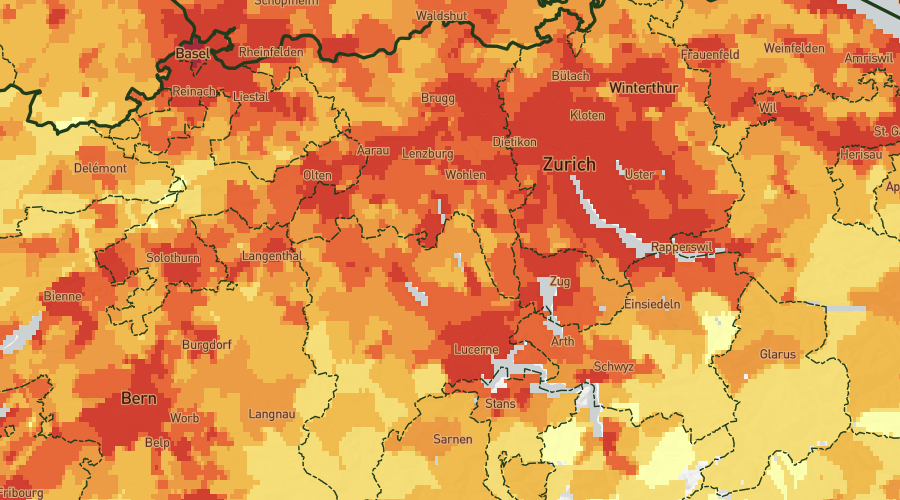

# Population Density Map and Vector Tiles

Easy way to overlay population density in your vector tile based maps. The vector tiles show population density
from [Gridded Population of the World (GPW) v4](http://sedac.ciesin.columbia.edu/data/set/gpw-v4-population-density) on the
basis of small polygons. The polygons not only count the population density but also styling indicators that show
relative importance on higher zoom levels.

[**:globe_with_meridians: Check the demo at naturalearthtiles.org**](http://naturalearthtiles.org)

[**:open_file_folder: Download the vector tiles from the releases page**](https://github.com/lukasmartinelli/populationtiles/releases/latest).



## Use Vector Tiles

You can use [**mbview**](https://github.com/mapbox/mbview) to take a look at the MBTiles vector tiles locally.

## Run Workflow

The entire project is structured components using Docker containers
to work together. Ensure you meet the prerequisites.

- Install [Docker](https://docs.docker.com/engine/installation/)
- Install [Docker Compose](https://docs.docker.com/compose/install/)

Start up the PostgreSQL database with the PostGIS extension.

```bash
docker-compose up -d postgres
```

Now import the Natural Earth data set (can take several minutes).

```bash
docker-compose run import-naturalearth
```

Import the required database schema (views, prepared tables and helper functions).

```bash
docker-compose run db-schema
```

Export the vector tiles for the planet (can take up to 15min).
The exported vector tiles are stored in `data/natural_earth.mbtiles`.

```bash
docker-compose run export-vectortiles
```

To visualize and work with the vector tiles you can spin up Mapbox Studio
in a Docker container and visit `localhost:3000`.

```bash
docker-compose up mapbox-studio
```

The raster tiles are exported directly from Mapbox Studio from the `raster-datasource`. This process is not automated yet.

## License

The produced vector tiles are made available under the Public Domain Dedication and License v1.0 whose full text can be found at: http://www.opendatacommons.org/licenses/pddl/1.0/.

The source code is Copyright (c) Lukas Martinelli under MIT as defined in [License](LICENSE).
